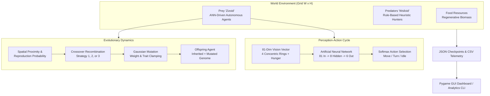

# 🧬 Artificial Life & Ecosystem Simulation Engine

[](https://github.com/maluve05/ALife-AI-NOVA-IMS/actions)
[](https://www.python.org/)
[](LICENSE)
[](https://pyga.me/)

An advanced **Artificial Life (ALife) & Artificial Neural Network (ANN) Evolutionary Simulation Platform** developed for academic research and computational biology at **NOVA Information Management School (NOVA IMS)**.

The platform simulates a 2D toroidal-like discrete grid ecosystem featuring autonomous agents (**Prey / "Zizoid"**, **Predators / "Wsiloid"**, and **Food Resources**) governed by neuro-evolution, genetic crossover strategies, Gaussian mutation, metabolic energy budgets, age-dependent vitality scaling, and multi-tier spatial vision.

---

## 🌟 Key Highlights

* **🧠 Neuro-Evolutionary Agents**: Prey entities possess an onboard Artificial Neural Network (81-dimensional spatial vision + hunger input $\to$ 8 hidden neurons $\to$ 6 softmax movement logits) encoded directly into a 712-element genetic chromosome.
* **🧬 Multi-Strategy Genetic Algorithms**: Dynamic mating pairs engage in crossover operations using 3 distinct recombination strategies (1-point, reverse 1-point, and 5-block ANN layer recombination) alongside Gaussian gene mutation with biological trait clamping.
* **⚡ Dual Execution Modes**:
  * **Interactive GUI Mode**: Real-time Pygame dashboard with dynamic graphs, telemetry statistics, Hall of Fame elite trackers, mortality monitoring, and interactive keyboard speed controls.
  * **High-Performance Headless CLI Mode**: Headless runner for batch simulations, automated benchmarking, parameter grid searches, and CI/CD pipelines.
* **📊 Comprehensive Telemetry & Analytics**: Native CSV time-series logging (`simulation_1.csv`), complete JSON world checkpoint serialization (`simulation_state.json`), and automated analytics suite (`analyze.py`) with phase-portrait graphing.
* **🧪 100% Test Coverage**: Complete automated unit and integration test suite with CI validation across Windows, macOS, and Linux on Python 3.10+.

---

## 🏗️ System Architecture



---

## 🚀 Quickstart Guide

### 1. Installation

Clone the repository and install dependencies in your virtual environment:

```bash
git clone https://github.com/maluve05/ALife-AI-NOVA-IMS.git
cd ALife-AI-NOVA-IMS

# Create and activate virtual environment
python -m venv .venv
# On Windows:
.venv\Scripts\activate
# On Linux / macOS:
source .venv/bin/activate

# Install requirements
pip install -r requirements.txt
```

*(Optional) For development, testing, and plotting tools:*
```bash
pip install -r requirements-dev.txt
```

---

### 2. Running Interactive Simulation (GUI Dashboard)

Launch the simulation directly from the root directory:

```bash
python main.py
```

You will be greeted by the interactive startup menu:
```
============================================================
       ARTIFICIAL LIFE ENVIRONMENT SIMULATION ENGINE
============================================================
[1] Load Previous Simulation State (.json)
[2] Run Default Simulation Configuration
[3] Modify Parameters & Create New Simulation
============================================================
```

#### 🎮 In-Game Controls:
| Key | Action |
|---|---|
| <kbd>SPACE</kbd> | Pause / Resume simulation |
| <kbd>↑</kbd> | Increase simulation speed (FPS / TPS) |
| <kbd>↓</kbd> | Decrease simulation speed (FPS / TPS) |
| <kbd>S</kbd> | Save immediate snapshot to `simulation_state.json` |
| <kbd>ESC</kbd> | Exit simulation |

---

### 3. Running Headless / Batch Experiments (CLI Mode)

To run unattended batch simulations without opening a GUI window (e.g. for parameter sweeps, server environments, or CI/CD):

```bash
# Run 500 ticks headlessly with deterministic random seed
python main.py --headless --ticks 500 --seed 42 --csv experiment_1.csv --json state_1.json
```

#### CLI Parameters:
```
Options:
  -H, --headless          Run simulation in headless mode (no Pygame window)
  -t, --ticks INT         Maximum number of ticks to simulate
  -l, --load PATH         Load simulation state from JSON checkpoint
  -c, --config PATH       Load simulation parameters from JSON config file
  -s, --seed INT          Set random seed for deterministic execution
  --csv PATH              Path to output CSV log file (default: simulation_1.csv)
  --json PATH             Path to output JSON checkpoint (default: simulation_state.json)
  --fps FLOAT             Target FPS limit for GUI mode
  --grid-width INT        Override grid width (e.g. 25)
  --grid-height INT       Override grid height (e.g. 30)
  --prey-count INT        Override starting Prey count
  --predator-count INT    Override starting Predator count
  --mutation-rate FLOAT   Override mutation rate (0.0 to 1.0)
  --log-interval INT      Metrics logging interval in ticks (default: 15)
```

---

### 4. Telemetry Analysis & Visualization

Process simulation CSV logs to compute evolutionary trends, population dynamics, and save analytical charts:

```bash
# Generate terminal statistics report
python Alife_Simulation/analyze.py --csv simulation_1.csv

# Generate 4-panel visual analytics chart (requires matplotlib)
python Alife_Simulation/analyze.py --csv simulation_1.csv --plot telemetry_chart.png
```

---

## 🔬 Mathematical & Evolutionary Formulation

### 1. Artificial Neural Network (ANN) Topology
* **Input Layer ($N=81$)**:
  * 4 concentric spatial vision rings around the agent oriented relative to its heading.
  * Ring 1 ($r=1$): 8 cells, Ring 2 ($r=2$): 16 cells, Ring 3 ($r=3$): 24 cells, Ring 4 ($r=4$): 32 cells.
  * Input 81: Normalized internal energy / hunger factor $\frac{E}{\text{Max Energy}}$.
* **Hidden Layer ($H=8$)**: Sigmoid activation $\sigma(z) = \frac{1}{1 + e^{-z}}$.
* **Output Layer ($K=6$)**: Softmax action probability distribution $P(\text{action}_k) = \frac{e^{z_k}}{\sum_{j=1}^6 e^{z_j}}$.
  * Actions: `[Forward-Right, Forward-Left, Forward, Backward, Turn, Idle]`.

### 2. Chromosome Encoding ($L = 712$)
$$\text{Genome} = [\underbrace{W_{\text{hidden}}}_{8 \times 81 = 648},\ \underbrace{B_{\text{hidden}}}_{8},\ \underbrace{W_{\text{output}}}_{6 \times 8 = 48},\ \underbrace{B_{\text{output}}}_{6},\ \underbrace{\text{Base Efficiency}}_{1},\ \underbrace{\text{Base Intelligence}}_{1}]$$

### 3. Vitality & Survival Equations
* **Life Expectancy ($LE$)**:
  $$LE = 0.03125 \times E_0 \times \left(1 + \frac{N_{\text{prey}}}{N_{\text{predator}} + 1}\right)$$
* **Gaussian Vitality Scaling ($G$)**:
  $$G(\text{Age}) = \exp\left(-\frac{1}{2}\left(\frac{\text{Age} - \mu}{\sigma}\right)^2\right), \quad \mu = \frac{LE}{2}, \quad \sigma = \frac{LE}{4}$$
* **Logarithmic Survival Probability**:
  $$P_{\text{survival}}(\text{Age}) = \max\left(0,\ 1 - \frac{0.70}{LE(\ln(LE) - 1)} \cdot \ln(\text{Age} + 1)\right)$$
* **Agent Fitness Function**:
  $$\text{Fitness} = 1.0 \times \text{Age} + 1.5 \times \text{Food Eaten} + 5.0 \times \text{Offspring} + 0.5 \times \text{Efficiency}$$

For the complete derivations, see [docs/mathematical_model.md](docs/mathematical_model.md).

---

## 🗂️ Repository Structure

```
ALife-AI-NOVA-IMS/
├── .github/
│   └── workflows/
│       └── ci.yml               # Automated GitHub Actions test pipeline
├── Alife_Simulation/
│   ├── code/
│   │   ├── __init__.py          # Core package exports & import resolution
│   │   ├── ANNprey.py           # Artificial Neural Network implementation
│   │   ├── food.py              # Food resource growth & nutrition model
│   │   ├── graphics.py          # Pygame dashboard, charts & HUD rendering
│   │   ├── predator.py          # Predator tracking & hunting mechanics
│   │   ├── prey.py              # Prey agent, vision encoding, vitality math
│   │   └── world.py             # World environment, grid, reproduction & physics
│   ├── analyze.py               # Telemetry data processor & chart generator
│   └── game.py                  # Main execution loop (GUI & Headless)
├── docs/
│   ├── analytics.md             # Data schemas & telemetry analysis guide
│   ├── architecture.md          # In-depth architectural & design documentation
│   ├── configuration_guide.md   # Simulation parameters reference & experiment presets
│   └── mathematical_model.md    # Formal mathematical model & biological equations
├── tests/
│   ├── __init__.py
│   ├── test_ann.py              # ANN unit tests (weights, activations, forward pass)
│   ├── test_food.py             # Food resource unit tests
│   ├── test_headless.py         # Headless execution integration tests
│   ├── test_predator.py         # Predator hunting & fitness unit tests
│   ├── test_prey.py             # Prey vision, scaling, and movement unit tests
│   ├── test_serialization.py   # JSON state and CSV log persistence tests
│   └── test_world.py            # World stepping, crossover, and mutation tests
├── .gitignore                   # Comprehensive Git ignore rules
├── CONTRIBUTING.md              # Contributor guidelines & code style
├── environment.yml              # Conda environment definition
├── LICENSE                      # MIT Open-Source License
├── main.py                      # Top-level executable entry point
├── pyproject.toml               # PEP 621 packaging & test configuration
├── requirements-dev.txt         # Development & testing dependencies
├── requirements.txt             # Runtime dependencies
├── simulation_1.csv             # Sample simulation telemetry log
└── simulation_state.json        # Sample saved world state checkpoint
```

---

## 🧪 Running the Test Suite

Execute the test suite using Python's native test runner or `pytest`:

```bash
# Using standard library unittest:
python -m unittest discover -s tests -p "test_*.py" -v

# Using pytest:
pytest
```

---

## 📚 Documentation Index

* 📐 [Mathematical Model & Equations](docs/mathematical_model.md)
* 🏛️ [Software Architecture & Design](docs/architecture.md)
* ⚙️ [Configuration & Parameter Tuning Guide](docs/configuration_guide.md)
* 📈 [Telemetry Analysis & Data Schemas](docs/analytics.md)
* 🤝 [Contributing Guidelines](CONTRIBUTING.md)

---

## 📄 License

This project is licensed under the MIT License - see the [LICENSE](LICENSE) file for details.
