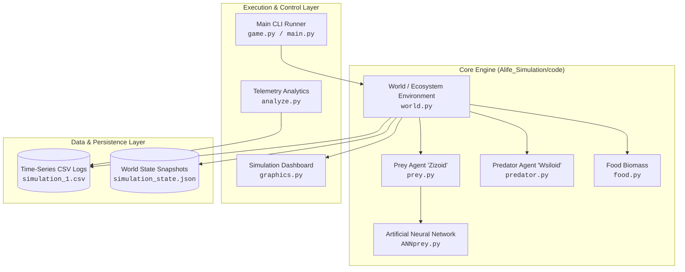
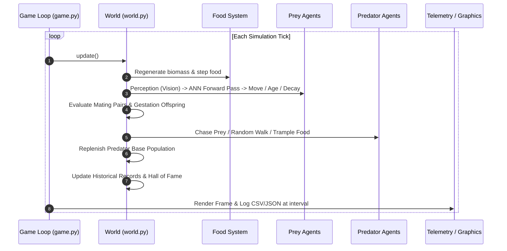

# System Architecture & Design Specification

This document provides a comprehensive structural and behavioral breakdown of the **Artificial Life (ALife) Ecosystem Simulation Engine**.

---

## 1. High-Level Architectural Overview

The simulation follows an **Agent-Based Modeling (ABM)** paradigm integrated with **Neuro-Evolutionary Computation**. The architecture is structured into decoupled functional domains:

---

## 2. Core Modules & Class Responsibilities

### 2.1 `World` (`Alife_Simulation/code/world.py`)
The orchestrator of spatial physics, agent life cycles, collision management, and evolutionary reproduction.
* **Spatial Grid**: Maintains a discrete 2D matrix (`grid[y][x]`) where:
  * `0` = Empty cell
  * `1` = Predator (`Wsiloid`)
  * `2` = Food resource
  * `3` = Prey (`Zizoid`)
  * `4` = Out-of-bounds boundary
* **Update Cycle** (`update()`):
  1. `_update_food_growth()`: Tracks unstepped cells and spawns new food after 10 dormant ticks.
  2. `_update_prey_agents()`: Drives perception, neural forward pass, spatial translation, energy expenditure, aging, and survival checks.
  3. `handle_prey_mating()`: Evaluates proximity ($\le 2$ cells), vision overlap, and joint reproduction probabilities.
  4. `_update_predator_agents()`: Drives heuristic pursuit, prey capture, food trampling, and predator replenishment.
  5. `update_historical_records()`: Tracks the Hall of Fame (all-time highest fitness individuals and mating pairs).

### 2.2 `Prey` (`Alife_Simulation/code/prey.py`)
Autonomous agent possessing a genetic chromosome, sensory raycaster, and internal ANN controller.
* **Chromosome ($712$ floats)**:
  * Genes $0 \dots 709$: ANN weights and biases.
  * Gene $710$: Base Efficiency trait ($10.0 - 30.0$).
  * Gene $711$: Base Intelligence trait ($10.0 - 30.0$).
* **Sensory System**: Raycasts 4 concentric sensory rings in egocentric orientation, combined with current hunger level to produce an 81-dimensional float vector.
* **Locomotion**: Transforms discrete neural action indices ($0 \dots 5$) into absolute grid step coordinates based on heading ($0=\text{North}, 1=\text{East}, 2=\text{South}, 3=\text{West}$).

### 2.3 `ANNPrey` (`Alife_Simulation/code/ANNprey.py`)
Custom vectorized feedforward neural network optimized for zero external dependencies.
* **Topology**: $81 \to 8 \to 6$.
* **Forward Pass**:
  $$\mathbf{h} = \sigma(\mathbf{W}_h \mathbf{x} + \mathbf{b}_h)$$
  $$\mathbf{y} = \text{softmax}(\mathbf{W}_o \mathbf{h} + \mathbf{b}_o)$$
* **Activation Functions**: Fast clamped Sigmoid and numerically stable Softmax.

### 2.4 `Predator` (`Alife_Simulation/code/predator.py`)
Heuristic hunting agent providing environmental selection pressure.
* **Hunting Logic**: Scans adjacent 8 Moore neighborhood cells for prey (`grid == 3`). If detected, enters `chase_state` and intercepts. Otherwise, executes random walk over empty or food cells.
* **Adaptation**: Successful captures boost tracking efficiency ($\times 1.1$) and replenish energy ($+10$). Failed chases incur energy penalties and tracking efficiency decay ($\times 0.9$).

### 2.5 `Food` (`Alife_Simulation/code/food.py`)
Biomass resource with age-dependent nutritional scaling.
* Nutrition scales linearly after 10 ticks:
  $$\text{Nutrition}(t) = \begin{cases} B & \text{if } t \le 10 \\ B \cdot (1 + 0.25(t - 10)) & \text{if } t > 10 \end{cases}$$

### 2.6 `SimulationGraphics` (`Alife_Simulation/code/graphics.py`)
Pygame-based real-time telemetry renderer displaying:
* Live discrete spatial grid with agent orientation indicators.
* Headcount and tick monitor.
* Real-time population time-series strip chart (Prey, Predators, Food).
* Fitness breakdown (Worst, Median, Elite Max Age).
* Global moving average traits (Energy, Intelligence, Efficiency).
* Hall of Fame showcase and mortality cause distribution.

---

## 3. The Execution Cycle

---

## 4. Design Patterns & Principles

1. **Decoupled Engine & Presentation**: The core world physics and agent logic contain zero Pygame dependencies, enabling instant headless simulation execution for scientific experiments.
2. **Encapsulated State Serialization**: World states can be serialized to JSON snapshots and resumed at any arbitrary tick without losing chromosome parameters, agent histories, or environmental state.
3. **Deterministic Experimentation**: Seedable random generators guarantee reproducible simulation runs across diverse execution platforms.
